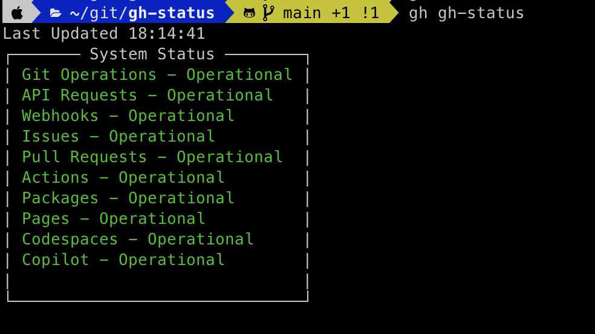
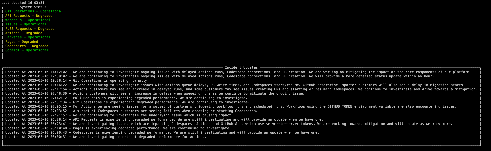

# GitHub Status Checker

This `gh` extension can be used to monitor the current status of GitHub based on the status page.  It can either be run once, or run with the watch flag to poll the page at a 1 minute interval.

## Installation
```shell
gh extension install wwsean08/gh-gh-status
```

## Usage
### Run once
```shell
gh gh-status
```

### Poll constantly
```shell
gh gh-status --watch
```

